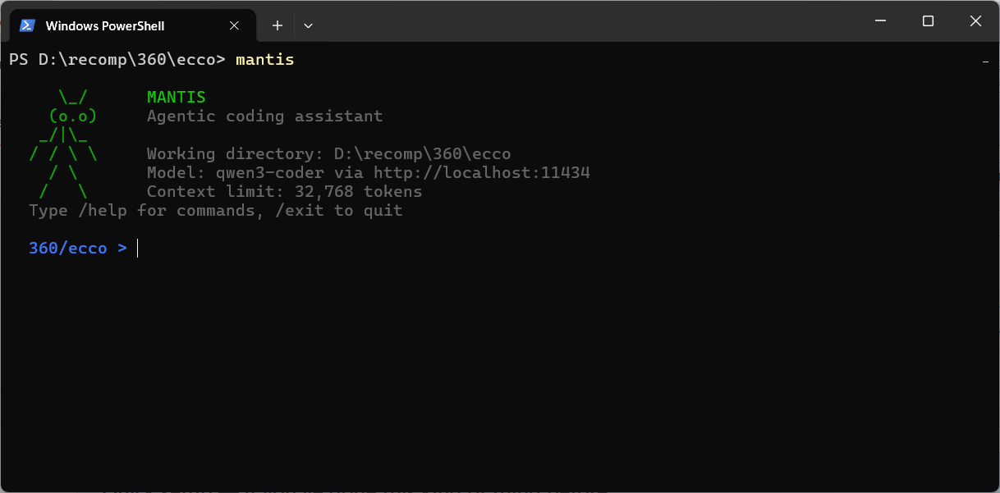

# Mantis

```
     \_/
    (o.o)    MANTIS
   _/|\_    Agentic coding assistant
  / / \ \
    / \
   /   \
```



**Your own AI coding assistant. Local or cloud. No limits.**

Mantis is an agentic coding CLI — like having a senior dev pair-programming with you in your terminal. It reads your files, writes code, runs commands, searches your codebase, and plans out complex tasks. Powered by any OpenAI-compatible LLM — run locally through [Ollama](https://ollama.com) or connect to cloud GPU providers like Together AI, Groq, Fireworks, and more.

---

## Quick Start

### One-line install

**Windows** (PowerShell):
```powershell
powershell -ExecutionPolicy Bypass -File scripts/install.ps1
```

**Linux/macOS**:
```bash
chmod +x scripts/install.sh && ./scripts/install.sh
```

The installer handles everything — Ollama, Node.js, GPU detection, model selection, PATH setup.

### Manual install

```bash
cd mantis
npm install
npm link

# Pull a model (pick one based on your GPU)
ollama pull qwen3-coder       # GPU — needs NVIDIA + CUDA
ollama pull qwen2.5-coder:14b # 12-16GB VRAM (RTX 5070/4080)
ollama pull qwen2.5-coder:32b # 24GB VRAM (RTX 4090/5090)
```

### Run it

```bash
cd ~/my-project
mantis
```

---

## Features

**10 built-in tools** — reads files, writes code, runs commands, searches your codebase, does surgical edits. It reads before it writes and chains tools together to accomplish complex tasks.

**Cloud & local providers** — Run locally with Ollama or connect to Together AI, Fireworks, Groq, OpenRouter, DeepInfra. Switch with `/provider set`.

**Autonomous mode** — `/auto "build a REST API"` and Mantis plans, writes, builds, tests, and delivers with no hand-holding. 100-iteration limit, all tool calls auto-approved.

**GPU-tiered install** — The installer detects your GPU and pulls the right model size automatically. From 7B on CPU to 32B on RTX 4090/5090.

**Plan mode** — Toggle with `/plan` to explore your codebase and design a plan without touching anything. Toggle off to execute.

**Context management** — Long conversations don't crash. Token usage is tracked and older messages are automatically compacted when the context window fills up.

**Persistent memory** — Tell the model to "save state to memory" and it persists notes for future sessions. Project-scoped (`.mantis/MEMORY.md`) or global (`~/.mantis/memory/MEMORY.md`).

**Skills** — 8 built-in slash commands (`/commit`, `/review`, `/test`, `/explain`, `/fix`, `/refactor`, `/deps`, `/init`) plus create your own with `/skill create`.

**Save/load conversations** — `/save` and `/load` to pick up where you left off.

**Model hot-swap** — `/model deepseek-coder-v2` to switch models without restarting.

---

## Commands

| Command | Description |
|---------|-------------|
| `/help` | Show all commands |
| `/exit` | Quit |
| `/clear` | Wipe conversation history |
| `/plan` | Toggle plan mode (read-only exploration) |
| `/status` | Show token usage, model info, stats |
| `/cd <dir>` | Change working directory |
| `/save [name]` | Save conversation |
| `/load [name]` | List or load saved conversations |
| `/compact` | Manually compress history |
| `/model <name>` | Switch model |
| `/config` | Show configuration |
| `/provider` | Show/switch providers, set API keys |
| `/auto <task>` | Run a task autonomously |
| `/memory` | Show saved memory |
| `/skills` | List all skills |
| `/<skillname>` | Run a skill (e.g. `/commit`, `/test`) |

---

## Providers

| Provider | Command | Free Tier |
|----------|---------|-----------|
| **Local (Ollama)** | `/provider set local` | Unlimited |
| **Together AI** | `/provider set together` | Yes (limited) |
| **Fireworks AI** | `/provider set fireworks` | Yes (limited) |
| **Groq** | `/provider set groq` | Yes (generous) |
| **OpenRouter** | `/provider set openrouter` | No |
| **DeepInfra** | `/provider set deepinfra` | Yes (limited) |

Set API keys with `/provider key <name> <key>`. Test with `/provider test`.

---

## Configuration

Settings live at `~/.mantis/config.json`:

```json
{
  "model": "qwen3-coder",
  "ollamaUrl": "http://localhost:11434",
  "provider": "local",
  "providerKeys": {},
  "maxContextTokens": 32768,
  "compactThreshold": 0.75,
  "commandTimeout": 60000,
  "maxToolResultSize": 8000,
  "confirmDestructive": true
}
```

---

## Requirements

- **Node.js** v18+
- **Ollama** — [ollama.com](https://ollama.com) (for local mode)
- **RAM** — 8GB minimum, 16GB recommended
- **Disk** — ~5GB for a local model

---

## License

MIT
