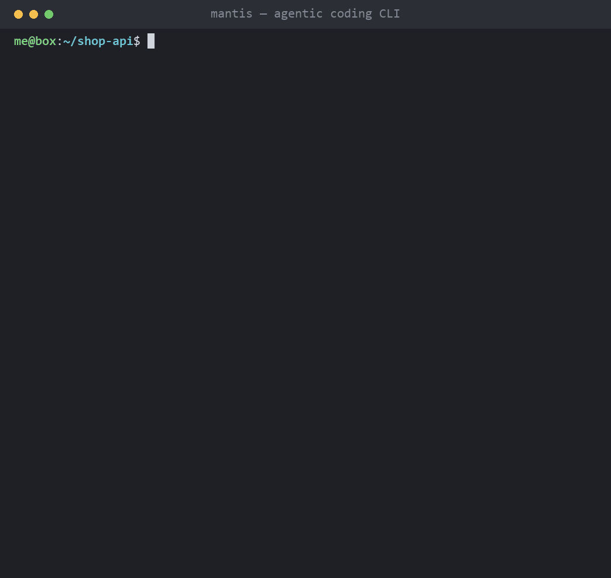

# Mantis

```
     \_/
    (o.o)    MANTIS
   _/|\_    Agentic coding assistant
  / / \ \
    / \
   /   \
```



**Your own AI coding assistant. Local or cloud. No limits.**

Mantis is an agentic coding CLI — a senior dev pair-programming with you in your
terminal. It reads files, writes code, runs commands, searches your codebase, and
plans complex tasks. Powered by any OpenAI-compatible LLM: run locally through
[Ollama](https://ollama.com), LM Studio, or llama.cpp, or connect to 20 cloud
providers including OpenAI, Claude, Gemini, Groq, Cerebras, and NVIDIA NIM.

It can also run **as an Anthropic-compatible proxy** — point the real Claude Code
CLI, the VS Code extension, or JetBrains at Mantis and they run on your own
provider pool.

---

## Quick Start

### Download a binary

Every release ships a self-contained executable with Node 22 baked in — there is
no runtime to install first. Grab one from the
[latest release](https://github.com/sp00nznet/mantis/releases/latest).

**Windows** — `Mantis-CLI-Setup-<version>.exe` installs it and puts `mantis` on
your PATH. Or take `Mantis-CLI-<version>-windows-x64.zip` and run it in place.

**macOS** — `-macos-arm64.pkg` for Apple Silicon, `-macos-x64.pkg` for Intel.
Both install to `/usr/local/share/mantis` and symlink `/usr/local/bin/mantis`:

```bash
sudo installer -pkg Mantis-CLI-3.6.0-macos-arm64.pkg -target /
```

**Linux** — the `.deb` uses the same layout:

```bash
sudo dpkg -i mantis-cli_3.6.0_amd64.deb
```

or run the tarball in place:

```bash
tar xzf Mantis-CLI-3.6.0-linux-x64.tar.gz && ./mantis
```

**Desktop app** — `Mantis-Desktop-Setup-<version>-win-x64.exe` (or the portable
`.exe`), `Mantis-Desktop-<version>-mac-{arm64,x64}.dmg`, or the Linux
`.AppImage` / `.deb`.

Check it landed with `mantis version`.

> **Nothing here is code-signed.** Windows SmartScreen will warn — *More info →
> Run anyway*. macOS will refuse the first launch — right-click → *Open*, or
> `sudo xattr -rd com.apple.quarantine /usr/local/share/mantis`.
>
> **The zip and tarball are a folder, not just a binary.** `mantis` sits next to
> `admin.html`, `shared.html`, and `assets/`, which it loads from disk at
> runtime — move the whole folder or `mantis admin` and `/share` will come up
> blank. The `.pkg` and `.deb` handle this for you.

### Or install from source

**Windows** (PowerShell):
```powershell
powershell -ExecutionPolicy Bypass -File scripts/install.ps1
```

**Linux/macOS**:
```bash
chmod +x scripts/install.sh && ./scripts/install.sh
```

The installer handles everything — Ollama, Node.js, GPU detection, model
selection, PATH setup. Manual setup is in [docs/getting-started.md](docs/getting-started.md).

### Run

```bash
cd ~/my-project
mantis                   # interactive REPL
```

Other entry points:

```bash
mantis run "<task>"      # run one task headlessly (scripts / CI)
mantis serve             # Anthropic-compatible proxy server
mantis admin             # provider & config web UI
mantis bot telegram      # run the Telegram bot
mantis bot discord       # run the Discord bot
mantis mcp-server        # expose Mantis's tools to another agent over MCP
```

---

## Features

- **23 providers** — Ollama, LM Studio, and llama.cpp locally, or 20 cloud
  providers (OpenAI, Claude, Gemini, Groq, Cerebras, NVIDIA NIM, Kimi, Z.ai, and
  more). Switch with `/provider set`. See [docs/providers.md](docs/providers.md).
- **17 built-in tools** — reads files, writes code, runs commands, searches the
  codebase, does surgical edits, **fetches/searches the web**, **generates images
  and speech**, **searches past conversations**. Reads before it writes; chains
  tools together. Plus a **sub-agent** tool for delegating subtasks.
- **Conversation search** — every session, chat, and bot thread is indexed
  (SQLite FTS5); `/recall <query>` and the agent's `search_memory` tool pull back
  relevant context from past work instead of asking you to repeat yourself. See
  [docs/search.md](docs/search.md).
- **MCP — client *and* server** — connect [MCP servers](docs/mcp.md) (filesystem,
  GitHub, Postgres, …) and their tools, resources, and prompts join the agent
  loop automatically; or run `mantis mcp-server` to expose Mantis's own tools to
  Claude Code, Cursor, or any other MCP client.
- **Autonomous mode** — `/auto "build a REST API"` and Mantis plans, writes,
  builds, tests, and delivers. 100-iteration limit, tool calls auto-approved.
- **Swarm mode** — `/swarm "refactor the auth module"` runs ALL your providers in
  parallel: one leads, the rest explore as read-only workers. See [docs/swarm.md](docs/swarm.md).
- **Checkpoints & undo** — every file change is snapshotted; `/undo` reverts it.
- **Post-edit hooks** — auto-run a formatter/linter/tests after each edit.
- **Cost & token tracking** — `/status` shows tokens used and estimated spend.
- **Vision & file attachments** — `/image <path>` in the REPL, a 📎 button
  in the desktop composer, and on each admin session — attach images (sent to
  vision models) or text files (content inlined).
- **Headless mode** — `mantis run "<task>"` for scripts and CI (`--json` output).
- **Anthropic-compatible proxy** — `mantis serve` lets the real Claude Code,
  VS Code, and JetBrains run on your provider pool. See [docs/proxy.md](docs/proxy.md).
- **Docker** — `docker build -t mantis .` runs the proxy + admin UI in a
  container; all data (config, sessions, search index) persists in a `/root/.mantis`
  volume.
- **Chat bots** — drive Mantis from Telegram or Discord, by text or **voice note**
  (transcribed automatically). Conversations now **persist across restarts** and
  idle ones **hibernate** out of memory, rehydrating on the next message. See
  [docs/bots.md](docs/bots.md).
- **Desktop app** — a Claude-style Electron app: general chat with persistent,
  resumable history (projects & git on the way). See [docs/desktop.md](docs/desktop.md).
- **Admin web UI** — `mantis admin` to manage keys, providers, and routing in a
  browser — plus a Sessions tab that runs live agents in xterm.js terminals.
- **Session sharing** — `/share` gives someone a link to **watch** your live
  session, or **join** it and drive the agent too. See [docs/sharing.md](docs/sharing.md).
- **Sign-in & multi-user** — optionally require a login (built-in accounts, or
  Google) for the admin panel and desktop app; each account gets an isolated
  workspace, with admin/user roles. Mobile layout too. See [docs/auth.md](docs/auth.md).
- **Plan mode** — `/plan` to explore and design without touching anything.
- **Context management** — long conversations auto-compact instead of crashing.
- **Persistent memory** — "save state to memory" persists notes across sessions.
- **Skills** — 11 built-in slash commands (incl. `/research`, `/design`,
  `/clone`) plus your own. Skills use the portable [agentskills.io](https://agentskills.io)
  `SKILL.md` format (shareable with Claude Code), and the agent can save a
  reusable workflow itself with the `create_skill` tool. See [docs/skills.md](docs/skills.md).
- **Robust tool calls** — understands native, JSON, *and* Hermes/Qwen XML
  tool-call formats (so local Qwen-Coder models work cleanly), with a runaway-output
  guard that truncates a model stuck repeating itself.
- **GPU-tiered install** — the installer pulls the right model size for your GPU.

---

## Commands

| Command | Description |
|---------|-------------|
| `/help` | Show all commands |
| `/exit` | Quit |
| `/clear` | Wipe conversation history |
| `/undo` | Revert the last file change the agent made |
| `/plan` | Toggle plan mode (read-only exploration) |
| `/status` | Token usage, estimated cost, model info, stats |
| `/recall <query>` | Search past conversations & memory (`/recall summarize` to compress) |
| `/image <path>` | Attach an image to your next message (vision) |
| `/mcp` | Show connected MCP servers and their tools |
| `/cd <dir>` | Change working directory |
| `/save [name]` · `/load [name]` | Save / load conversations |
| `/compact` | Manually compress history |
| `/model <name>` | Switch model |
| `/config` | Show configuration |
| `/provider …` | Show/switch providers, set API keys ([docs](docs/providers.md)) |
| `/auto <task>` | Run a task autonomously |
| `/swarm <task>` | Use all configured providers in parallel ([docs](docs/swarm.md)) |
| `/proxy [stop]` | Start/stop the Anthropic-compatible proxy ([docs](docs/proxy.md)) |
| `/admin` | Start the admin web UI (providers, proxy, live sessions) |
| `/remote [stop]` | Share this REPL session to the admin panel ([docs](docs/proxy.md#sharing-a-repl-session--remote)) |
| `/share [join]` | Get a link to watch or join this session ([docs](docs/sharing.md)) |
| `/bot <telegram\|discord>` | Start a chat bot ([docs](docs/bots.md)) |
| `/memory` | Show saved memory |
| `/skills` · `/<skillname>` | List / run skills (e.g. `/commit`, `/test`) |

---

## Use Mantis as a Claude Code backend

`mantis serve` starts a server that speaks the Anthropic Messages API and routes
each request to one of your configured providers. Point any Anthropic client at it:

```bash
mantis serve
# then, in another shell:
ANTHROPIC_BASE_URL=http://127.0.0.1:8787 claude
```

Claude's `opus`, `sonnet`, and `haiku` tiers each route independently — send Opus
traffic to Claude, Sonnet to Groq, Haiku to a local model, whatever you like.
Configure routing in the admin UI or `~/.mantis/config.json`. Full details in
[docs/proxy.md](docs/proxy.md).

---

## Providers

23 providers work out of the box — all OpenAI-compatible, switchable with
`/provider set <name>`.

- **Local** — Ollama, LM Studio, llama.cpp (no API key)
- **Free tier standouts** — Google Gemini (1M tokens/day), Groq, Cerebras,
  NVIDIA NIM (free key from build.nvidia.com), Mistral (1B tokens/month)
- **Frontier models** — OpenAI, Anthropic, Gemini, xAI, Kimi, Z.ai
- **Open-model hosts** — Together, Fireworks, DeepInfra, Novita, SambaNova,
  Chutes, OpenRouter, Perplexity, Cohere

```
/provider set gemini              # switch provider
/provider key gemini YOUR_KEY     # add an API key
/provider test                    # verify the connection
/provider list                    # see them all
```

The full table — base URLs, default models, free-tier notes — is in
[docs/providers.md](docs/providers.md).

---

## Documentation

| Guide | What it covers |
|-------|----------------|
| [Getting Started](docs/getting-started.md) | Install, first session, troubleshooting |
| [Providers](docs/providers.md) | All 23 providers, base URLs, default models |
| [Swarm Mode](docs/swarm.md) | Multi-provider parallel execution |
| [Proxy](docs/proxy.md) | Anthropic-compatible proxy + admin UI |
| [MCP](docs/mcp.md) | Connecting MCP servers, and running Mantis as one |
| [Conversation Search](docs/search.md) | Full-text recall across past sessions |
| [Session Sharing](docs/sharing.md) | Watch/join links for a live session |
| [Sign-in & Multi-user](docs/auth.md) | Local accounts, roles, per-account workspaces |
| [Chat Bots](docs/bots.md) | Telegram & Discord wrappers, session persistence |
| [Desktop App](docs/desktop.md) | The Claude-style Electron app |
| [Tools](docs/tools.md) | The 17 built-in tools |
| [Skills](docs/skills.md) | Built-in and custom slash commands |
| [Plan Mode](docs/plan-mode.md) | Read-only exploration mode |
| [Memory](docs/memory.md) | Persistent cross-session memory |
| [Context Management](docs/context-management.md) | How long sessions stay alive |
| [Configuration](docs/configuration.md) | `config.json` reference |
| [Architecture](docs/architecture.md) | How Mantis works under the hood |

---

## Requirements

- **Node.js** v22+ (v22.5+ enables conversation search via the built-in SQLite)
- **Ollama** — [ollama.com](https://ollama.com) (for local mode; optional if you
  use a cloud provider)
- **RAM** — 8GB minimum, 16GB recommended
- **Disk** — ~5GB for a local model

---

## License

MIT
